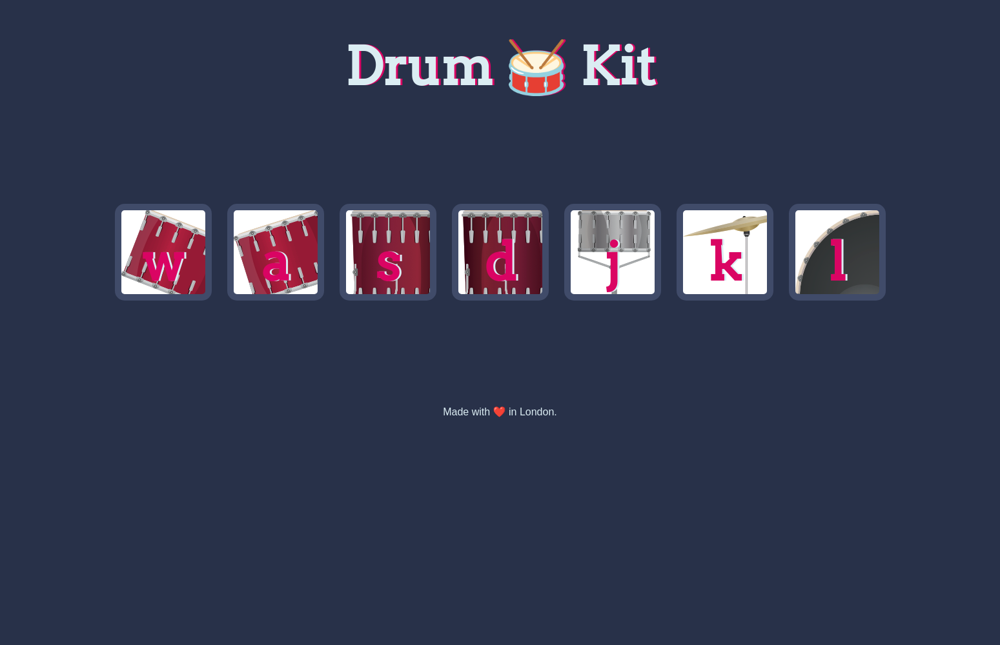

# Drum 🥁 Kit

[Play the Drum Kit](https://raimonvibe.github.io/Drumkit/)

## Description

A fun and interactive drum kit that lets you play drums using your keyboard! Press the corresponding keys to create your beats.

## How to Play

1. Visit the [live demo](https://raimonvibe.github.io/Drumkit/)
2. Press the keys shown on screen to play different drum sounds
3. Create your own beats and have fun!

## Technologies Used

- HTML5
- CSS3
- JavaScript

## Features

- Interactive keyboard controls
- Realistic drum sounds
- Visual feedback on key press
- Responsive design
